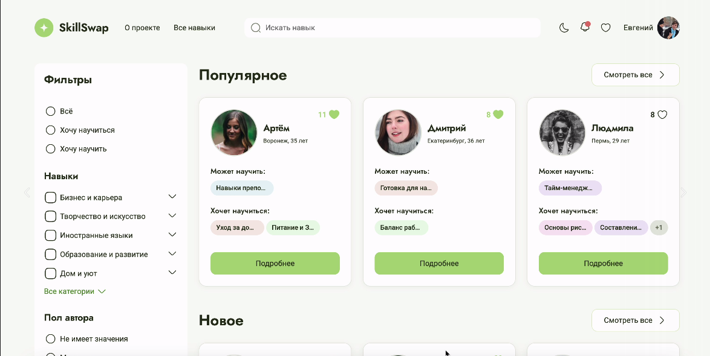
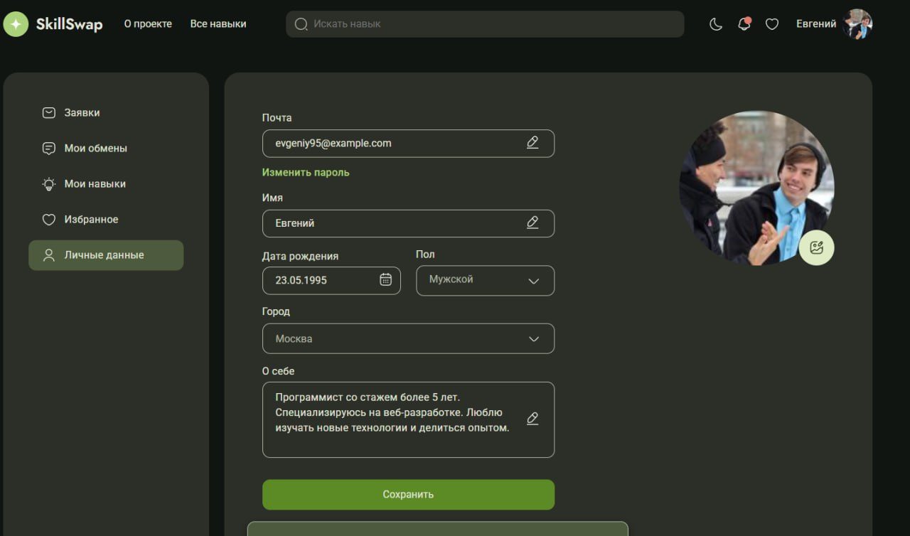

# SkillSwap

[Live Demo](https://skill-swap-42-1-ofvj.vercel.app) 🌐

---


Командный учебный проект, выполненный в рамках проектного месяца
(Яндекс Практикум) и доработанный мной для портфолио.

## О проекте
SkillSwap — платформа для обмена навыками между пользователями.

## Моя роль и вклад
В проекте я отвечала за:

- разработку и типизацию моков (skills, categories, users, likes)
- интеграцию данных через API
- реализацию динамической шапки в зависимости от авторизации
- систему уведомлений (удаление, очистка, состояния)
- фильтрацию контента через шапку
- верстку и логику личного кабинета
- работу с темной темой (иконки, изображения, инпуты)
- кастомный хук для валидации форм + тесты
- UI-состояния: loaders, empty states, blur overlay

### Примеры моих pull request’ов:

- Кастомный хук валидации форм с тестами  
  https://github.com/PM-YandexPracticum/SkillSwap_42_1/pull/355

- Логика уведомлений и рефакторинг структуры по FSD  
  https://github.com/PM-YandexPracticum/SkillSwap_42_1/pull/231

- Динамическое изменение шапки в зависимости от авторизации пользователя  
  https://github.com/PM-YandexPracticum/SkillSwap_42_1/pull/224

- Интеграция данных через API  
  https://github.com/PM-YandexPracticum/SkillSwap_42_1/pull/102

## Стек технологий
React, TypeScript, Vite, FSD, Jest, ESLint, Stylelint

## Чему я научилась
- работа в команде и через pull requests
- поддержка и развитие большого проекта
- структурирование кода по FSD
- написание переиспользуемых хуков
- типизация данных и работа с API

## Скриншоты



## Требования
- Node.js (рекомендуется v16+)

## Установка зависимостей
```bash
npm install
```

## Запуск dev-сервера
```bash
npm run dev
```

## Production сборка и превью
```bash
npm run build
```

```bash
npm run preview
```

## Линтинг
Проверка кода на соответствие правилам:
```bash
npm run lint
```

Автоисправление проблем:
```bash
npm run lint:fix
```

## Тесты
Проект использует Jest для unit-тестов и `@testing-library/jest-dom` для DOM-матчеров.
Запустить тесты (однократный прогон):
```bash
npm run test
```

Запустить в режиме наблюдения (watch):
```bash
npm run test:watch
```

Оценить покрытие тестами:
```bash
npm run test:coverage
```
Файл инициализации тестовой среды: `src/setupTests.ts` (импортирует `@testing-library/jest-dom`).
